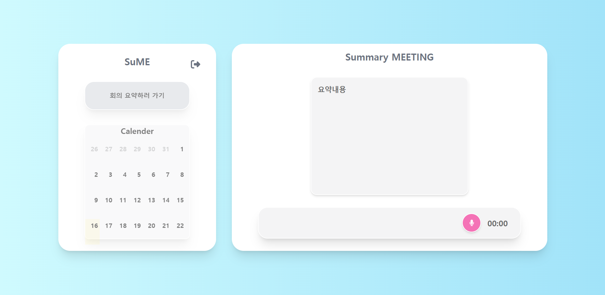

# Frontend 개요

## 📝 프로젝트 소개

이 프로젝트는 **React 기반 프론트엔드**로, 사용자가 **웹 인터페이스**를 통해 음성 업로드 및 일정 관리 기능을 이용할 수 있도록 합니다.
백엔드와 연동하여 **사용자 인증, 음성 데이터 처리 및 일정 관리** 기능을 제공합니다.

### 🖥️ 화면 구성
|MainPage|
|:---:|
||
|녹음을 통해 요약 내용을 볼 수 있고, 이를 기반으로 일정이 생성되어 캘린더에 저장할 수 있습니다.|

## ⚙ 기술 스택

> 이 프로젝트는 다음과 같은 프레임워크 및 라이브러리를 사용하여 개발되었습니다.

| 기술 | 설명 |
|------|------|
| **React** | UI 개발을 위한 JavaScript 라이브러리 |
| **Tailwind CSS** | 스타일링을 위한 유틸리티 퍼스트 CSS 프레임워크 |
| **React Router** | 클라이언트 사이드 라우팅을 위한 라이브러리 |
| **Fetch API** | 백엔드와의 데이터 통신을 위한 API 요청 방식 |

## ⚡ Requirements

### Node.js 및 npm 버전 확인
```
$ node --version
22.13.1

$ npm --version
10.9.2
```

## 🚀 프론트엔드 실행 방법

1️⃣ node_modules 설치

```
$ npm install
```

2️⃣ React 실행

```
$ npm start
```

## 📂 Frontend Structure

```
src
│  API.js                            # API 요청 관리
│  App.css
│  App.js                            # 메인 애플리케이션 컴포넌트
│  App.test.js
│  index.css
│  index.js                          # React 엔트리 포인트
│  ProtectedRoute.js                 # 인증이 필요한 라우팅 처리
│  reportWebVitals.js
│  setupTests.js
│
└─pages
    │  Header.jsx                    # Header 컴포넌트
    │  Title.jsx
    │
    ├─calender
    │      calender.css
    │      Calender.jsx              # 캘린더 UI
    │      calenderSummary.css
    │      CalenderSummary.jsx       # 캘린더 요약 UI
    │
    ├─login
    │      Auth.jsx                  # 회원가입 컴포넌트
    │      login.jsx                 # 로그인 컴포넌트
    │
    └─mainpage
            Mainpage.jsx             # 녹음 및 요약 컴포넌트
            RecordedAudio.jsx
            RecordingButton.jsx
            SumLayout.jsx
            TimerDisplay.jsx
```
